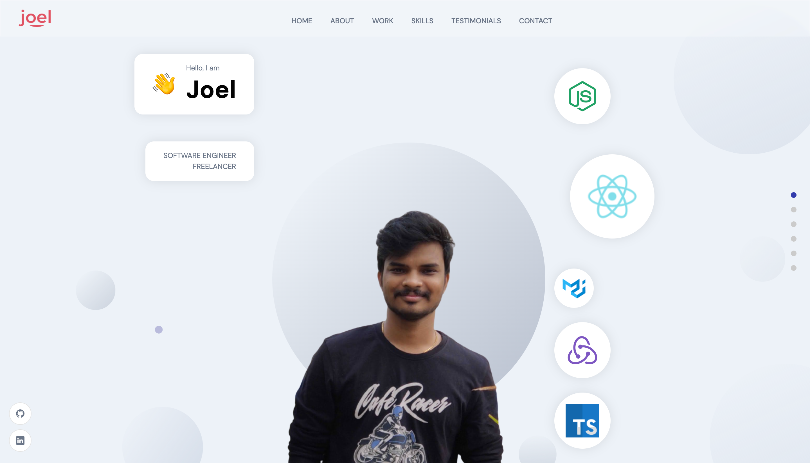

# Welcome

[Demo](https://jvk.netlify.app)

## Introduction
Hi, this is my personal portfolio. I made this to showcase my projects.

## How did I build

* User interface with React.js with SASS
* Sanity as a backend to store the details of each section
* Assorted all images as one module
* Used framer motion for animations

## Environment

```
REACT_APP_SANITY_PROJECT_ID=
REACT_APP_SANITY_TOKEN=
```
